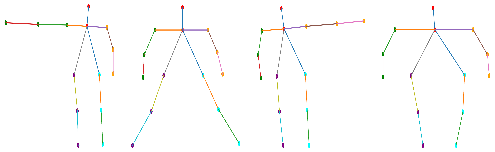

# CSIPose-code
CSIPose-code
We designed CSIPose, a method for estimating the pose of human skeleton maps in through-the-wall scenes using CSI amplitude information. CSIPose contains a CSI data processing method, AveCSI, which can unify CSI affected by dynamic and static poses into CSI frames of the same size. Thus, AveCSI ensures that the same depth learning model can be trained to estimate dynamic and static poses. However, since the same pose affects CSI differently in dynamic and static contexts, we have to generate a separate model for estimating dynamic and static poses. The performance of the model is shown below.

The ground truth skeleton map:

The reconstructed skeleton map:
